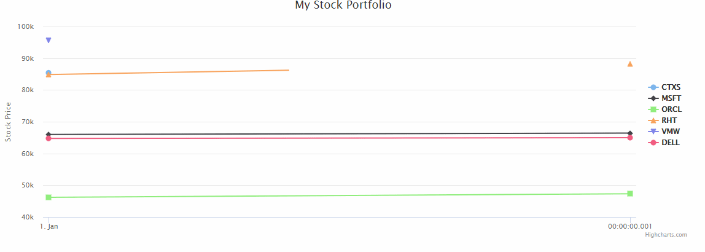

# weflux 和Streaming数据的demo，用于交互式开发

- 启动quote-stream和streaming-server服务
- 启动完成后如果你没有zookeeper和kafka环境可能会报Zookeeper和kafka连不上的错误，但这个并不影响项目。
- 如果只看响应效果，就可以忽略报错。
- 在浏览器输入： [localhost:8082/quotes](localhost:8082/quotes) 可实时监控数据的变化
    
    效果如下： 
    
    
    
    
